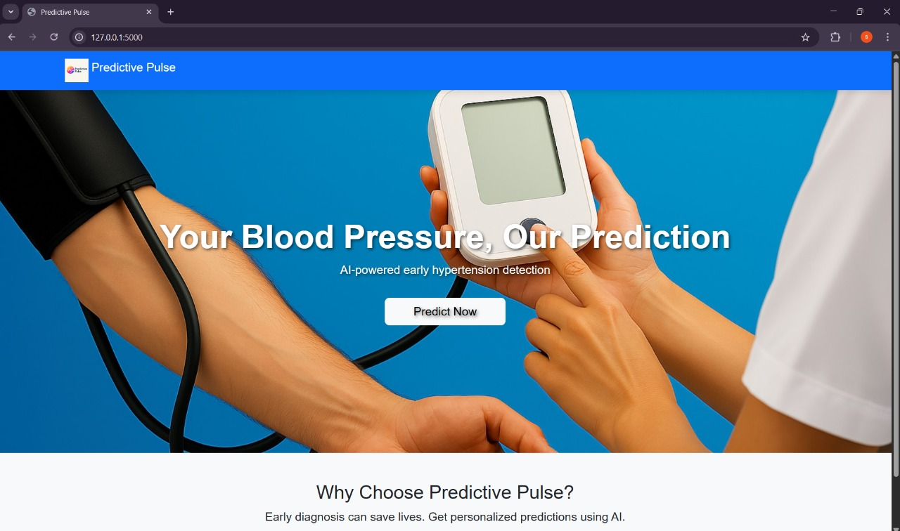
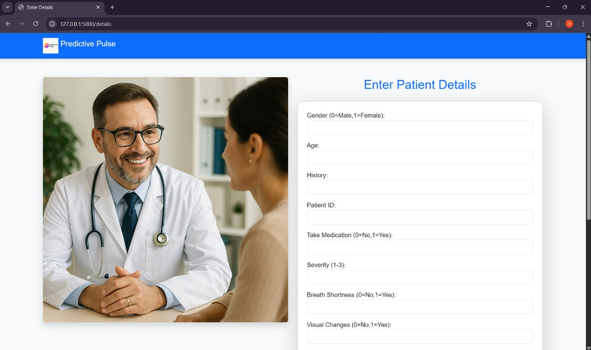
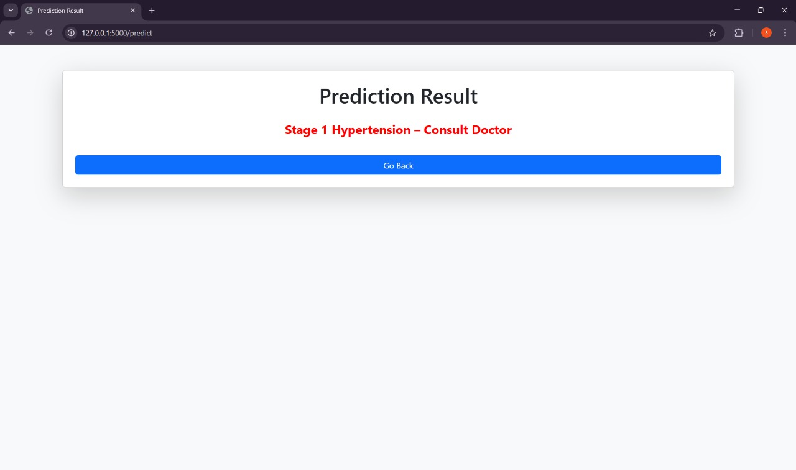

# 🩺 Predictive Pulse: Blood Pressure Analysis using Machine Learning

## 👨‍💻 Team
- Shivraj Nalawade  
- Swapnil Lonkar
- Pratik  Bhosale
- Avishka Kadam
*(MIT Academy of Engineering, Alandi, Pune)*
---

## 📌 Project Overview
Predictive Pulse is a **machine learning-powered application** designed to **analyze and predict blood pressure trends**.  
It integrates with wearable devices or health monitoring systems, helping patients and healthcare providers get **real-time insights** to prevent hypertension complications.

---

## ✨ Features
- 📊 **Predict blood pressure stages** using ML models  
- 🧠 **Random Forest-based best model** for high accuracy  
- 🌐 **Web interface built with Flask**  
- ☁️ **Deployable to cloud platforms** (e.g., IBM Cloud, Render)  
- 📈 **Real-time health insights** based on systolic & diastolic readings  

---

## 🛠 Tech Stack
- **Frontend:** HTML, CSS (Flask Templates)
- **Backend:** Python, Flask
- **Machine Learning:** Scikit-learn, Pandas, Numpy
- **Model:** Random Forest Regressor (saved as `best_model.pkl`)
- **Version Control:** Git & GitHub

---

## 🚀 How to Run Locally

1. **Clone the repository:**
   ```bash
   git clone https://github.com/shivraj-nalawade/PredictivePulseML.git
   cd PredictivePulseML

2.  **Create and activate a virtual environment:**
    python -m venv myenv
    myenv\Scripts\activate   # For Windows

3. **Install dependencies:**
    pip install -r requirements.txt

4. **Run the Flask app:**
    python app.py

5. **Open your browser and go to:**
    http://127.0.0.1:5000

    

## 🖼 Screenshots

### 1. Homepage  


### 2. Enter Patient Details Page  


### 3. Prediction Result Page  



## 🎥 Project Demonstration  

Watch the full project demonstration here: [Click to Watch](https://drive.google.com/file/d/1ae333fSZ2IR_9_VIWvdh1JtstJxOUWf3/view?usp=drive_link)


